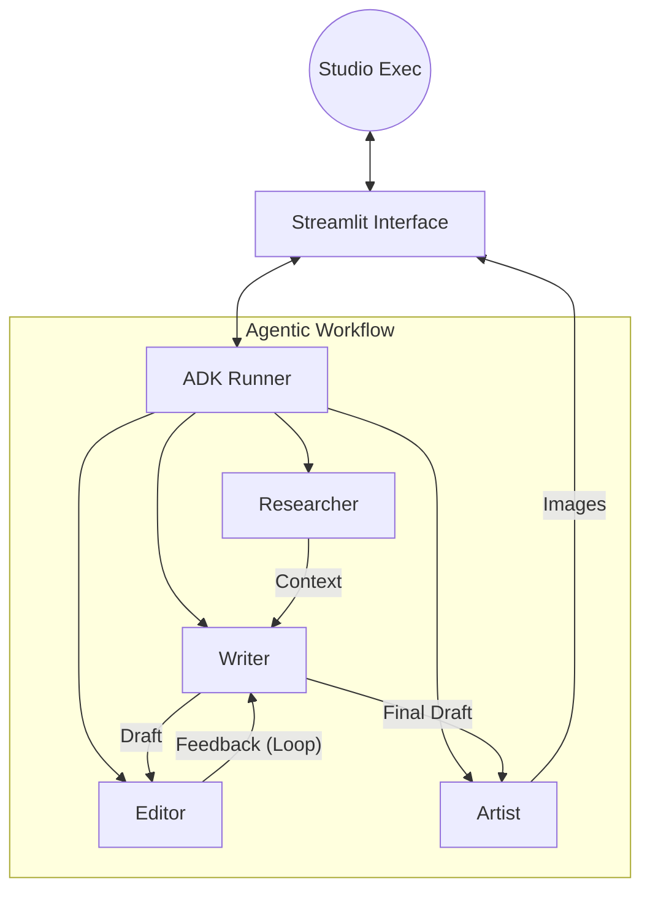

# 🎬 AI Screenwriting Studio: An Agentic Creative Workflow

## 🚀 Why , What

### 💡 Core Concept & Value
**The Problem:**
Screenwriting is a notoriously difficult, lonely, and iterative process. Writers often suffer from "blank page syndrome," lack immediate feedback on their drafts, and struggle to visualize how their words will translate to the screen. Traditional AI tools (chatbots) often lose context over long scripts or fail to switch "hats" effectively between creative writing and critical editing.

**The Solution:**
The **AI Screenwriting Studio** is an Agentic AI application designed using the Google Agent Development Kit (ADK). It simulates a real-world Hollywood production office by orchestrating a team of specialized AI agents. instead of a single generalist model, users interact with a **Researcher**, a **Screenwriter**, a critical **Editor**, and a **Storyboard Artist**.

**The Value:**
*   **Specialization:** By using distinct agent personas, the "Editor" can be ruthless without inhibiting the "Writer's" creativity.
*   **Human-in-the-Loop:** The application allows the human user to act as the "Studio Executive," overriding AI decisions and editing intermediate artifacts (research briefs, drafts) before the next agent sees them.
*   **Visual feedback:** The inclusion of a Storyboard agent bridges the gap between text and screen immediately.

### 📝 Project Journey & Vision
This project began with the goal of moving beyond simple "prompt-response" interactions. I wanted to build a **system** where AI agents collaborate. The architecture evolved from a simple linear chain into a state-aware application where an Editor agent can reject a script, provide feedback, and force the Writer agent to iterate—mimicking the actual creative cycle of film production.

---

## 🛠️ How: The Implementation

### 🏗️ Architecture & Technical Design
The application is built using **Python**, **Streamlit** (for the UI), and the **Google Agent Development Kit (ADK)**.

**The Agent Team:**
1.  **🕵️‍♂️ Researcher Agent:** Uses broad reasoning to generate character bios, loglines, and world-building context.
2.  **✍️ Screenwriter Agent:** Specializes in "Fountain" syntax and dialogue. It takes context from the Researcher and instructions from the Editor.
3.  **🧐 Editor Agent:** A "Quality Assurance" agent. It does not write; it evaluates. It outputs structured JSON data containing a score (0-10) and critique, enabling the system to programmatically decide whether to "greenlight" the script.
4.  **🎨 Storyboard Artist:** A tool-using agent that parses the script for visual imagery and calls an image generation tool (mocked for this demo) to visualize scenes.

**System Diagram:**


### 🧠 Key Agentic Concepts Implemented
I have implemented the following core concepts from the course:

1.  **Multi-Agent Orchestration (Specialized Personas):**
    *   Instead of one prompt doing everything, tasks are split. The *Editor* agent uses a low temperature (0.1) for critical analysis, while the *Writer* uses a higher temperature (0.7) for creativity.
    
2.  **Tool Use (Function Calling):**
    *   The agents are equipped with Python functions as tools.
    *   `save_script_to_file`: Allows the agent to finalize work.
    *   `generate_storyboard_image_mock`: Allows the agent to request visual assets based on text descriptions.

3.  **Human-in-the-Loop (HITL):**
    *   The Streamlit UI intercepts the output of the Researcher. The user can edit the "Research Brief" before the Writer sees it.
    *   The user can add "Manager Notes" to override or supplement the AI Editor's feedback during the revision loop.

4.  **Structured Output & Control Flow:**
    *   The **Editor Agent** is forced to output **JSON**. This is crucial for the application logic. The Python code parses this JSON to update the UI state (Green vs. Red status) and determine if the workflow *should* proceed to storyboarding.

### 💻 Code Quality
*   **Modular Design:** The code is separated into `config.py` (settings), `agent.py` (definitions), `tools.py` (capabilities), and `app.py` (UI/Logic).
*   **Async/Sync Bridging:** The application handles the asynchronous nature of the ADK Runner within the synchronous Streamlit environment using `asyncio` wrappers.
*   **State Management:** `InMemorySessionService` is used to maintain conversation history, while Streamlit's `session_state` manages the cross-tab artifacts (scripts, images).

---

## 📚 Documentation

### Prerequisites
*   Python 3.10+
*   Google Cloud Project with Vertex AI API enabled. (to be implemented if time permits)
*   `GOOGLE_API_KEY` set in your environment.

### Installation
1.  **Clone the repository:**
    ```bash
    git clone https://github.com/yourusername/agentic_ai_screenwriting_studio.git
    cd agentic_ai_screenwriting_studio
    ```

2.  **Install dependencies:**
    ```bash
    pip install -r requirements.txt
    ```
    *(Ensure `streamlit`, `google-cloud-aiplatform`, and `google-generativeai` are included).*

3.  **Run the application:**
    ```bash
    streamlit run app.py
    ```

### Usage Guide
1.  **Tab 1 (Research):** Enter a logline. Click "Run Researcher". Review and edit the output.
2.  **Tab 2 (Writing):** Click "Write Script". The agent uses the research to draft scenes.
3.  **Tab 3 (Editing):** Click "Run Editor". The AI will score your script. If the score is low, go back to Tab 2 and click "Revise" (the feedback is automatically passed to the writer).
4.  **Tab 4 (Visuals):** Once approved, generate the storyboard to see the "shot list." Currently, place-holder is used instead of actual generation just for demo purposes. A different model is required such as Veo or Imagen to generate the storyboard image output.  

---

## 🌟 Others

### 💎 Effective Use of Gemini
This project relies on **gemini-2.5-flash-lite**.
*   **Why?** Screenwriting requires maintaining context over long dialogue sequences. Gemini 2.5 Flash Lite's massive context window (1 million input tokens) ensures the "Writer" remembers the "Researcher's" character flaws defined at the start of the session, even after multiple revision loops.
*   **Reasoning:** The "Editor" agent relies on the model's high thinking and reasoning capabilities to provide specific, actionable critique rather than generic praise.

### ☁️ Deployment Strategy (currently deployed locally, if time permits will add cloud capability)
While currently running locally for this submission, this architecture is designed for cloud deployment:
1.  **Containerization:** The `app.py` and `requirements.txt` can be wrapped in a `Dockerfile`.
2.  **Cloud Run:** The stateless nature of the Streamlit frontend combined with the external Google GenAI API calls makes this ideal for **Google Cloud Run**.
3.  **Session Persistence:** For a production deployment, the `InMemorySessionService` would be swapped for a cloud database-backed session service (e.g., supabase) to allow users to save their studio projects permanently.  Currently, SQL Lite is used to save the various ideas, and storyboard outputs.